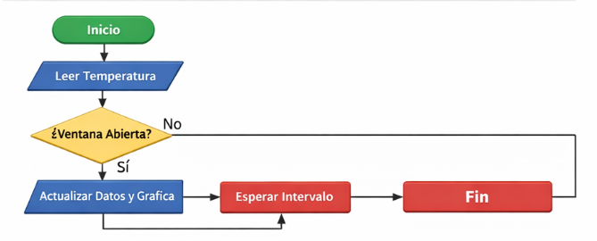
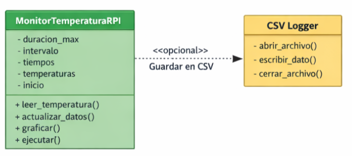

[](https://classroom.github.com/a/xB5owuT7)
[](https://classroom.github.com/online_ide?assignment_repo_id=23014625&assignment_repo_type=AssignmentRepo)
# Lab03: Visualización interactiva de datos en Raspberry Pi usando Python y Matplotlib

## Integrantes
Laura Leon\
Camilo Chavista\
Brayan Dueñas

## Documentación

# 📊 Monitor de Temperatura de CPU en Raspberry Pi zero 2w

##  Descripción 

Este proyecto implementa un **monitor de temperatura en tiempo real para
la CPU de una Raspberry Pi** utilizando **Python**. El programa obtiene
periódicamente la temperatura del procesador y la muestra en una
**gráfica dinámica que se actualiza en tiempo real** con la librería
**Matplotlib**.

El sistema mantiene una ventana temporal de datos recientes y actualiza
continuamente la gráfica mientras la ventana permanezca abierta.

El repositorio incluye **dos versiones del script**:

-   **Versión real:** lee la temperatura real de la CPU utilizando un
    comando del sistema de Raspberry Pi.
-   **Versión simulada:** genera temperaturas aleatorias para probar el
    funcionamiento del monitor sin necesidad de una Raspberry Pi.

------------------------------------------------------------------------

#  Gráficas Obtenidas:


La gráfica muestra:

-   **Eje X:** tiempo transcurrido desde el inicio del monitoreo.
-   **Eje Y:** temperatura de la CPU en grados Celsius.
-   Actualización continua en tiempo real.

------------------------------------------------------------------------

#  Funcionamiento general

El programa está organizado en una **clase principal llamada
`MonitorTemperaturaRPI`**, la cual gestiona todo el proceso de
monitoreo.

Esta clase se encarga de:

-   Leer la temperatura del sistema.
-   Almacenar datos de tiempo y temperatura.
-   Actualizar una gráfica en tiempo real.
-   Controlar el ciclo de ejecución del monitoreo.

------------------------------------------------------------------------

#  Explicación de las funciones del código

## **init**(self, duracion_max=60, intervalo=0.5)

Este método es el **constructor de la clase** y se ejecuta cuando se
crea el objeto del monitor. Recibe dos parámetros: `duracion_max`, que
define el tiempo máximo de datos que se mostrarán en la gráfica, y
`intervalo`, que indica el tiempo entre cada lectura de temperatura.
Dentro del método se inicializan las listas donde se almacenan los
tiempos y temperaturas registradas, se guarda el momento en que inicia
el monitoreo utilizando `time.time()`, y se crea la figura de Matplotlib
donde se dibujará la gráfica. Este método no devuelve valores pero
prepara todas las variables necesarias para el funcionamiento del
sistema.

## leer_temperatura(self)

Esta función obtiene la temperatura actual del procesador. En la versión
real del programa ejecuta el comando del sistema `vcgencmd measure_temp`
mediante `subprocess.check_output`, lo cual permite ejecutar comandos
del sistema desde Python y capturar su salida. El resultado se procesa
para extraer el valor numérico de la temperatura y convertirlo en un
número decimal. Si ocurre un error durante la lectura, el bloque
`try...except` captura la excepción y devuelve `None` evitando que el
programa se detenga. En la versión simulada del programa, esta función
genera un valor de temperatura aleatorio entre 80 °C y 150 °C utilizando
la librería `random`.

## actualizar_datos(self)

Esta función actualiza las listas que almacenan los datos del monitoreo.
Primero calcula el tiempo transcurrido desde el inicio del programa y
luego obtiene una nueva medición de temperatura llamando a
`leer_temperatura()`. Si la lectura es válida, los valores se agregan a
las listas de tiempos y temperaturas. Además, elimina los datos más
antiguos cuando superan el tiempo máximo definido por `duracion_max`,
manteniendo solo la información reciente que se mostrará en la gráfica.

## graficar(self)

La función `graficar` actualiza la gráfica que muestra el comportamiento
de la temperatura en el tiempo. Primero limpia la gráfica anterior para
evitar superposición de datos y luego dibuja nuevamente la curva
utilizando los valores almacenados en las listas de tiempos y
temperaturas. También agrega el título de la gráfica, etiquetas de los
ejes y una cuadrícula para mejorar la visualización. Finalmente
actualiza la ventana gráfica para mostrar los cambios en tiempo real.

## ejecutar(self)

Este método controla el ciclo principal del monitoreo. Dentro de un
bucle se verifica si la ventana de la gráfica sigue abierta utilizando
`plt.fignum_exists(self.fig.number)`. Mientras la ventana exista, el
programa actualiza los datos y vuelve a dibujar la gráfica. Entre cada
iteración se utiliza `time.sleep(self.intervalo)` para controlar la
frecuencia de actualización del monitoreo. Además, el método permite
interrumpir el programa de forma segura y cerrar correctamente la
ventana gráfica cuando el monitoreo termina.

------------------------------------------------------------------------

#  Diagrama de flujo:
El siguiente diagrama muestra el flujo general de ejecución del sistema de monitoreo.



Proceso general:

Inicia el programa.

Se obtiene la temperatura del sistema.

Se verifica si la ventana de la gráfica sigue abierta.

Si está abierta:

se actualizan los datos

se actualiza la gráfica

el sistema espera el intervalo definido

El proceso se repite continuamente hasta que el usuario cierre la ventana.


------------------------------------------------------------------------

#  Diagrama de clases:
El diseño del programa se basa en una clase principal encargada de gestionar el monitoreo.



La clase MonitorTemperaturaRPI contiene:

Atributos

duracion_max → duración máxima de datos mostrados en la gráfica

intervalo → tiempo entre mediciones

tiempos → lista de tiempos registrados

temperaturas → lista de temperaturas registradas

inicio → momento en que comienza el monitoreo

Métodos

leer_temperatura() → obtiene la temperatura actual

actualizar_datos() → guarda las nuevas mediciones

graficar() → actualiza la gráfica en tiempo real

ejecutar() → controla el ciclo principal del monitoreo

------------------------------------------------------------------------


## Preguntas

1. ¿Qué función cumple ```plt.fignum_exists(self.fig.number)``` en el ciclo principal?
   Esta función verifica si la ventana de la gráfica sigue abierta. El ciclo principal del programa continúa ejecutándose únicamente mientras la figura exista. Si el usuario cierra la ventana, la función devuelve False y el ciclo termina automáticamente.

3. ¿Por qué se usa ```time.sleep(self.intervalo)``` y qué pasa si se quita?
   Se utiliza para controlar la frecuencia de actualización del monitoreo. Esto evita que el programa consuma demasiados recursos del procesador y que la gráfica se actualice demasiadas veces por segundo. Si se elimina, el ciclo se ejecutará lo más rápido posible, lo que puede provocar alto consumo de CPU y una gráfica difícil de interpretar.

5. ¿Qué ventaja tiene usar ```__init__``` para inicializar listas y variables?
   Permite que todas las variables necesarias del objeto se creen automáticamente cuando se instancia la clase. Esto mejora la organización del código y evita errores relacionados con variables no definidas.

7. ¿Qué se está midiendo con ```self.inicio = time.time()```?
   Se guarda el momento exacto en el que inicia el monitoreo. Posteriormente se utiliza para calcular el tiempo transcurrido desde que comenzó el programa.

9. ¿Qué hace exactamente ```subprocess.check_output(...)```?
    Permite ejecutar comandos del sistema operativo desde Python y obtener la salida generada por el comando.

11. ¿Por qué se almacena ```ahora = time.time() - self.inicio``` en lugar del tiempo absoluto?
    Porque resulta más útil mostrar en la gráfica el tiempo transcurrido desde el inicio del monitoreo en lugar de la hora absoluta del sistema.

13. ¿Por qué se usa ```self.ax.clear()``` antes de graficar?
    Para limpiar la gráfica anterior antes de dibujar la nueva, evitando que se acumulen múltiples líneas superpuestas.

15. ¿Qué captura el bloque ```try...except``` dentro de ```leer_temperatura()```?
    Captura posibles errores durante la ejecución del comando que obtiene la temperatura, evitando que el programa se detenga inesperadamente.

17. ¿Cómo podría modificar el script para guardar las temperaturas en un archivo .```csv```?
   
Para guardar las temperaturas registradas se puede agregar código como
el siguiente:

``` python
import csv

with open("temperaturas.csv", "a", newline="") as archivo:
    writer = csv.writer(archivo)
    writer.writerow([ahora, temp])
```

Esto permitirá analizar los datos posteriormente en herramientas como
Excel, MATLAB o Python.
